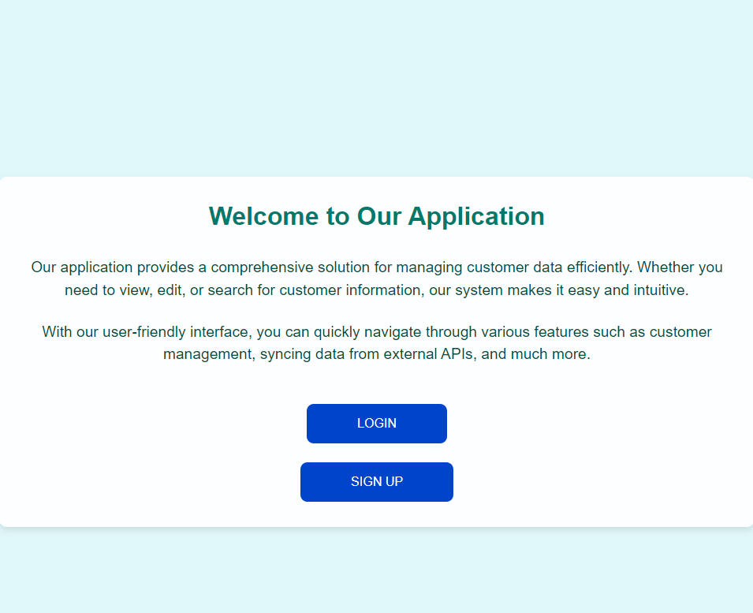
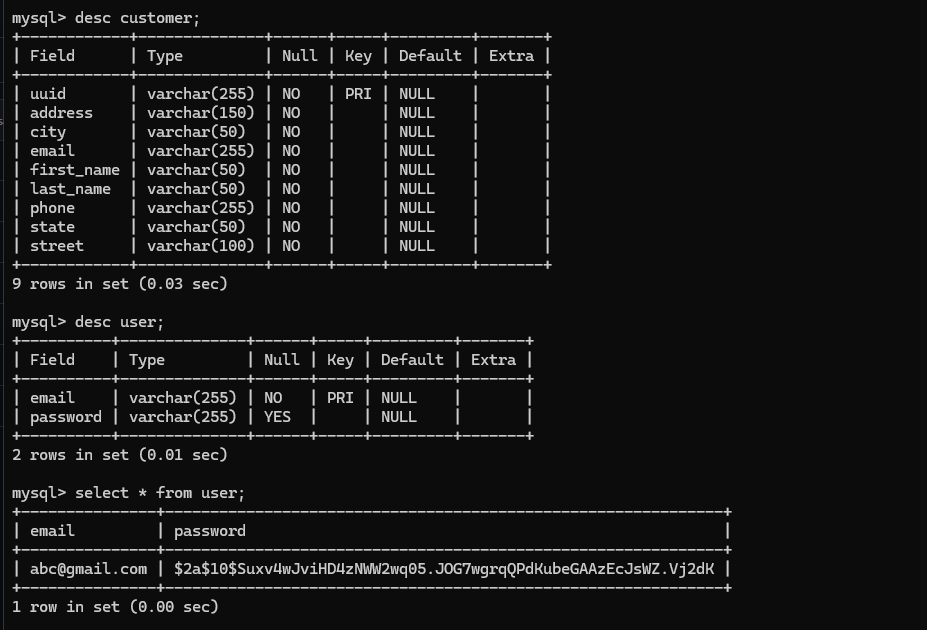

# ClientSync

## Table of Contents
- [Introduction](#introduction)
- [Screenshots](#ui-screenshots)
- [Features](#features)
- [Technologies Used](#technologies-used)
- [Setup Instructions](#setup-instructions)
- [Demo Video](#demo-video)
- [API Endpoints](#api-endpoints)
- [Contact](#contact)

## Introduction
The ClientSync is a web-based application designed to manage customer data efficiently. It allows users to add, view, update, delete, and search for customers. The application also supports synchronization of customer data from an external API. The project includes a frontend application developed with HTML, CSS, and JavaScript, and a backend API developed using Spring Boot and Java.

## UI Screenshots
**Home Page**



**Login Page**


**Sign Up Page**


**All Customers**


**Add a New Customer**


**Edit Customer Details**


**Database Schema**



## Features
- Add new customers
- View customer details
- Update existing customer information
- Delete customers
- Search for customers based on various fields
- Synchronize customer data from an external API

## Technologies Used
### Frontend
- HTML
- CSS
- JavaScript
- VS Code Live Server

### Backend
- Java
- Spring Boot
- Spring Security
- JWT Token
- JPA (Java Persistence API)
- MySQL

## Database Setup
1. Create a database
   ```sh
   CREATE DATABASE database_name
   ```
3. Update the `application.properties` file with your MySQL database credentials.
    ```sh
    spring.datasource.url=jdbc:mysql://localhost:3306/database_name
    spring.datasource.driver=com.mysql.cj.jdbc.Driver
    spring.datasource.username=root
    spring.datasource.password=your_password
    ```
## Setup Instructions
### Prerequisites
- JDK
- MySQL
- STS or any Java-supported IDE
- VS Code

### Frontend
1. Clone the repository:
    ```sh
    git clone https://github.com/Fiza32/ClientSync.git
    ```
2. Navigate to the Frontend Directory:
    ```sh
    cd ClientSync
    cd Frontend
    ```
3. Open in VS Code:
   Open the frontend directory in VS Code.
    ```sh
    code .
    ```
4. Run the Development Server:
   If using VS Code Live Server, open index.html and click on the "Go Live" button in the bottom right corner of VS Code.

    Alternatively, you can use a different local server setup if you have one configured.

    The application will be accessible at http://localhost:5500 by default with Live Server.

### Backend
1. Clone the repository:
    ```sh
    git clone https://github.com/Fiza32/ClientSync.git
    ```
2. Navigate to the Frontend Directory:
    ```sh
    cd ClientSync
    cd Backend
    ```
3. Build and Run the Application:
   Use Maven to build and run the Spring Boot application.
   Using Maven:
    ```sh
    ./mvnw spring-boot:run
    ```

## Demo Video
- **Google Drive Link:** 

## API Endpoints
- **Register a new User**
- `POST /api/sunBase/auth/register`
  ```sh
  {
  "email": "john.doe@example.com",
  "password": "password123"
  }
  ```
- **Login**
- `POST /api/sunBase/auth/login`
  ```sh
  {
  "email": "john.doe@example.com",
  "password": "password123"
  }
  ```

- **Add Customer**
  - `POST /api/sunBase/save_customer`
  - Request Body: JSON containing customer details
    ```sh
    {
    "first_name": "John",
    "last_name": "Doe",
    "street": "123 Main St",
    "address": "Apt 101",
    "city": "New York",
    "state": "NY",
    "email": "john.doe@example.com",
    "phone": "123-456-7890"
    }
    ```

- **Get Customer By ID**
  - `GET /api/sunbase/{id}`

- **Get All Customers**
  - `GET /api/sunbase/all_customers`

- **Delete Customer**
  - `DELETE /api/sunbase/deleteCustomer/{id}`

- **Search Customers**
  - `GET /api/sunbase/search_customers?field={field}&value={value}`

## Contact
- Md Faizan Raza
- **Email:** mdfaizan878@gmail.com
